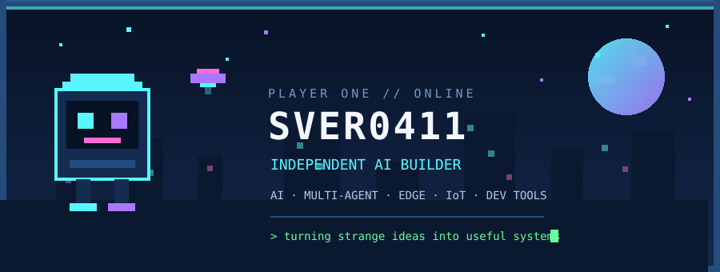
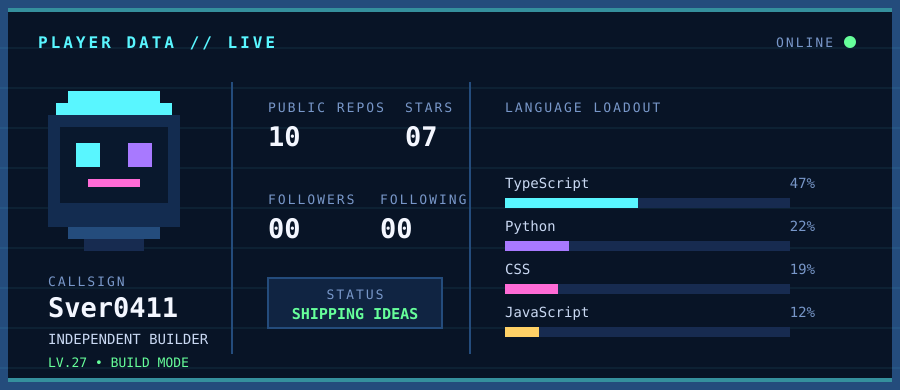

<div align="center">
  
</div>

<br>

<div align="center">
  <code>BUILDING</code> AI systems &nbsp;•&nbsp; <code>EXPLORING</code> edge intelligence &nbsp;•&nbsp; <code>SHIPPING</code> useful tools
</div>

## 🎮 Player Profile

Independent developer exploring **AI**, **multi-agent systems**, **edge AI**, **IoT**, and **language-learning tools**. I like projects that connect software with the real world—and tools that make complicated workflows feel simple.

> **Current objective:** build small, dependable systems that people can actually use.

## 🗺️ Active Quests

| Quest | Mission | Stack |
| :--- | :--- | :--- |
| [**ContextGit**](https://github.com/Sver0411/ContextGit) | Portable context and handoff infrastructure for coding agents | `Python` `Git` `Agents` |
| [**RAG Research Platform**](https://github.com/Sver0411/RAG-research-platform) | Evidence-grounded knowledge-base research with reproducible experiments | `Python` `RAG` `Full-stack` |
| [**LinguaStep**](https://github.com/Sver0411/LinguaStep-GradPrep) | A personal Japanese and English learning companion | `TypeScript` `EdTech` |
| [**ScrollPilot**](https://github.com/Sver0411/ScrollPilot) | Automatic natural/standard scrolling switcher for macOS | `Swift` `macOS` |
| [**Daily Push**](https://github.com/Sver0411/daily-push) | Course schedule and weather notifications for Feishu/Lark | `Python` `Docker` |

## 🧰 Inventory

```text
╔══════════════ LOADOUT ══════════════╗
║ CORE       Python · TypeScript      ║
║ NATIVE     Swift · macOS            ║
║ SYSTEMS    Git · Docker · IoT       ║
║ AI         RAG · Agents · Edge AI   ║
║ STATUS     Learning / Building      ║
╚═════════════════════════════════════╝
```

## 📟 Live Stats

<div align="center">
  
</div>

<sub>↻ This card is generated from the GitHub API and refreshed every day by GitHub Actions.</sub>

## 🌐 Open Channel

<div align="center">
  <a href="https://twclab.top"><strong>WORLD WIDE WEB</strong></a>
  &nbsp; // &nbsp;
  <a href="https://github.com/Sver0411?tab=repositories"><strong>ALL REPOSITORIES</strong></a>
</div>

<br>

<div align="center">
  <code>PRESS START TO EXPLORE</code><br><br>
  <sub>Made with curiosity, stubbornness, and a suspicious amount of terminal time.</sub>
</div>
